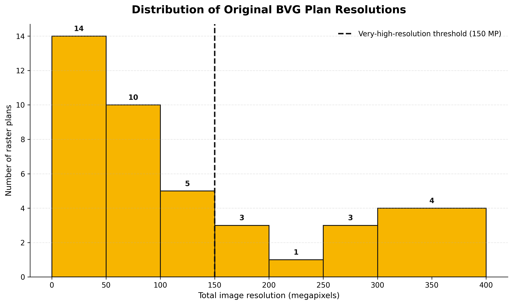
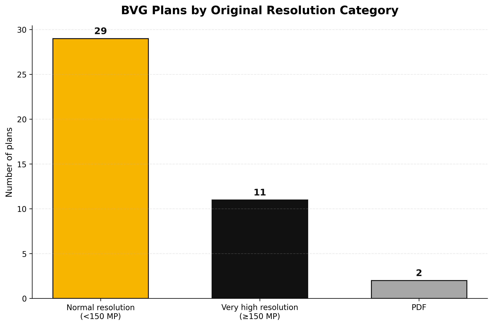
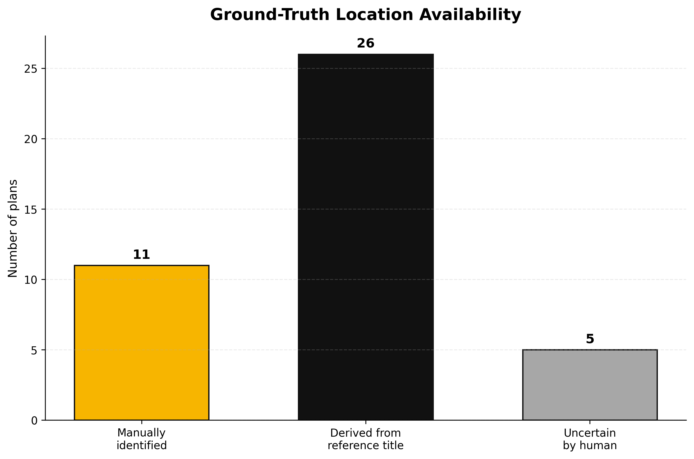

# Planarchiv - making BVG U-Bahn plans searchable

**Project documentation**

Blended Intensive Programme project with the BVG (Berliner Verkehrsbetriebe).

The BVG archive holds scanned construction plans of the Berlin U-Bahn - many
of them decades old, with handwritten or Kurrent lettering and old
spellings. This project reads every plan with a vision language model, pulls
out **where** the plan is about (location) and **what** it shows (title),
says how sure it is, and makes the plans searchable - also when the search
uses today's spelling and the plan an old one. A person checks and corrects
the results in a local web app.

**Status (2026-10-01):** working prototype, pipeline version **v10**,
tested by the team on 42 real plans.

| Person | Role |
|---|---|
| Jose  |  requirements, pipeline and app, testing on real plans |
| Eledina | translation of v5, ground truth, image size analysis and charts |
| Moritz S | requirements, pipeline and app, testing on real plans, documentation of the OCR approach |
| Daniel | testing: title and Location evaluation against the ground truth |
| Asia | team lead: project management, final presentation and report, scavenger hunt |
| Adriana | team lead: project management, final presentation and report, scavenger hunt |

### Team leads (Asia and Adriana)

As a team, our main job was to guide our group and make sure everything came together. We combined all our group results into the final presentation and final report. We also led and guided our scavenger hunt, recorded the video from our scavenger hunt using a DJI microphone for clear sound, and then we edited the video using the VN app. To show what our group is all about, we fully presented it during our presentation days, explaining what we focus on and how we are moving forward. Throughout the project, we took care of the project management for our group to keep us organized and on track.

---

## Contents

1. [Data](#1-data)
   1. [The plans](#11-the-plans)
   2. [Image resolution analysis](#12-image-resolution-analysis)
   3. [Ground truth](#13-ground-truth)
   4. [Analysis and evaluation files](#14-analysis-and-evaluation-files)
   5. [Data handling](#15-data-handling)
2. [Development](#2-development)
   1. [Timeline](#21-timeline)
   2. [First approach: classic OCR](#22-first-approach-classic-ocr)
   3. [Pipeline versions v1 - v10](#23-pipeline-versions-v1---v10)
   4. [Architecture (v10)](#24-architecture-v10)
   5. [Key decisions](#25-key-decisions)
3. [Testing](#3-testing)
   1. [Unit tests](#31-unit-tests)
   2. [Testing on the real plans](#32-testing-on-the-real-plans)
   3. [Title evaluation against the ground truth (Daniel)](#33-title-evaluation-against-the-ground-truth-daniel)
   4. [Results and findings](#34-results-and-findings)
4. [Using the app](#4-using-the-app)
5. [Known issues and next steps](#5-known-issues-and-next-steps)
6. [Repository structure](#6-repository-structure)

---

## 1. Data

### 1.1 The plans

- Scanned construction plans of Berlin U-Bahn stations from the BVG archive,
  many decades old, with handwritten or Kurrent lettering and old spellings.
- File types: TIFF (often 1-bit black/white, sometimes multi-page), PNG,
  JPEG, PDF, ...
- The team tested on **42 real plans**.
- File names sometimes carry notes ("ungültig", "nie gebaut", ...). These
  plans are kept and flagged, not dropped.
- The plans themselves are not in the repository (BVG data). Only the
  results read from them and the ground truth are.

### 1.2 Image resolution analysis

*Who:* **Eledina (Data Analyst)**  
*Scripts:* `analysis/analyze_image_sizes.py`, `analysis/plot_image_size_analysis.py`  
*Output:* `analysis/results/image_sizes.csv`, charts in `analysis/results/charts/`

The original raster resolution of every plan was analysed.

For raster images, the resolution is calculated as:

```text
megapixels = width × height / 1,000,000
```

This measures the total number of image pixels in megapixels and is different from the stored file size in MB.

For the analysis, plans are grouped into:

- **Normal resolution:** below 150 MP
- **Very high resolution:** 150 MP or more
- **PDF:** handled separately

The 150 MP threshold is a project-defined analysis threshold, not a universal definition of high resolution.

For the 42 plans:

- 29 are normal-resolution raster plans
- 11 are very-high-resolution raster plans
- 2 are PDFs





The resolution analysis is relevant because the HTW server accepts at most about 16.6 MP per image (see [decision 5](#5-16-mp-pixel-budget-and-1-bit-fix-v9)). Therefore, large original plans must be resized before they are sent to the model.

Resolution and resize scale are also used in the evaluation charts to examine patterns in recognition performance.

### 1.3 Ground truth

*Who:* **Eledina (Data Analyst)**  
*Ground-truth file:* `analysis/results/title_location_groundtruth_vs_predictions_v9.xlsx`  
*Chart script:* `analysis/plot_ground_truth_location_status.py`

The title and location reference values were checked manually and compared with the model predictions.

All 42 plans have a reference title. For location, the ground truth also records how the reference value was obtained:

- **11** locations were identified manually
- **26** locations were derived from the verified plan title
- **5** locations were uncertain even for a human

Therefore, all **42 titles** can be evaluated, while **37 locations** have a reliable human reference. The 5 uncertain locations are kept explicitly as uncertain and are excluded from the main location accuracy calculation.

The chart below shows the availability and origin of the location ground truth. It describes the reference-data availability and uncertainty; it is not a model-performance chart.



### 1.4 Analysis and evaluation files

The current files used for the analysis and evaluation are:

| File | Purpose |
|---|---|
| `analysis/results/title_location_groundtruth_vs_predictions_v9.xlsx` | human-verified title/location ground truth together with the corresponding model predictions used for comparison |
| `testing/v4/evaluation_results_v4.csv` | detailed current V4 title and location evaluation results used by the visualization scripts |
| `testing/v4/evaluation_summary_v4.csv` | aggregated current V4 evaluation results |
| `testing/v4/evaluate_titles_v4.py` | current combined title and location evaluation script |

The analysis and visualization scripts are:

- `analysis/analyze_image_sizes.py`
- `analysis/plot_image_size_analysis.py`
- `analysis/plot_ground_truth_location_status.py`
- `analysis/visualize_title_results.py`
- `analysis/visualize_location_results.py`

Generated charts are stored in:

`analysis/results/charts/`


### 1.5 Data handling

- **BVG plans are not in the repository.** The plans belong to the BVG.
  Plan images (`*.tif`, `*.tiff`) and `data/` are git-ignored, so plans
  do not end up in the repository by accident.
- **In the repository on purpose:** the results read from the plans and
  the ground truth (`analysis/results/`, `testing/`) - no plan images.
- **The API key and the server address are not in the repository.**
  They are read from `.env`
  (git-ignored), see [4. Using the app](#4-using-the-app).
- **The plan folder is only read.** The app never writes into it, so it can
  be a read-only archive or network drive.

**Where the app keeps its data** (per plan folder, never inside the plan folder):

```
data/<folder name>-<hash>/
├── results.json         current result per plan
├── reviews.json         human reviews  ← manual work, back it up
├── analysis_log.jsonl   every analysis ever made (for comparing versions)
├── plans.xlsx           Excel export
├── last_run.csv         timings of the last run
└── cache/               resized images and originals for the viewer
```

---

## 2. Development

### 2.1 Timeline

Oldest first. Versions of the analysis pipeline are kept side by side
(`versions/`, current one in `src/`), so every step can be re-run.

#### 2026-09-28 - HTW API connection tests

*Who:* Jose. *Commits:* `2e7d089`, `771aa00`.
*Files:* `experiments/htw_connection/`

- First connection tests to the HTW API (text and vision request with a test photo).

#### 2026-09-28 - v1-v5 and OCR experiments

*Who:* Jose and Moritz. *Commit:* `fb374d6`.
*Files:* `versions/scan_plan_htw_api_v1.py` ... `v5.py`, `experiments/ocr_paddleocr/`

- v1: send each plan image to the vision model, ask for the title, write a CSV.
- v2: shrink to 3000 px / optional crop before sending; prompt mentions metro stations.
- v3: 4 parallel requests, thinking switched off, image cache, timing columns in the CSV.
- v4: thinking switched on again, 2 parallel requests, timeouts and retries.
- v5: streaming with live progress, connection test before the run
  (translated to English later by Eledina).
- PaddleOCR experiments (basic OCR, export, evidence, tiling), see
  [2.2](#22-first-approach-classic-ocr).

#### 2026-09-28 - v5 translated, first results

*Who:* Eledina. *Commit:* `e2fd36d`.
*Files:* `versions/scan_plan_htw_api_v5.py`, `analysis/results/results_v5.csv`

#### 2026-09-29 - v5 extended: fixed data model, repeatable results, PDFs, traffic light

*Who:* Jose and Moritz. *Commit:* `7e9ae82`.
*Files:* `versions/scan_plan_htw_api_v5.py`, `src/models.py`

- The model answers in a fixed structure (`Metadata`: location, title,
  date) enforced by a JSON schema; results as `ImageData`.
- Repeatable settings: no thinking, temperature 0, fixed seed.
- PDFs are rendered and analysed like images.
- Traffic light for the title from the model's token probabilities.

#### 2026-09-29 - v6: traffic light for location and date

*Who:* Jose and Moritz. *Commit:* `7e9ae82`.
*Files:* `versions/scan_plan_htw_api_v6.py`

- Traffic light for every field. Prompt: location without words like
  "Haltestelle" (they made the location ambiguous).

#### 2026-09-29 - v7: local app, fuzzy search, Excel, BVG design

*Who:* Jose and Moritz. *Commit:* `7e9ae82`.
*Files:* `versions/scan_plan_htw_api_v7.py`, `src/app.py`, `src/search.py`,
`src/export_xlsx.py`, `src/static/index.html`, `tests/test_search.py`

- Local web app: choose a folder, analysis in the background, list,
  search, popup with the plan. English UI in the style of bvg.de.
- Fuzzy search on location and title: ß/ss, umlauts, old spellings
  (Thor/Tor), abbreviations, sound-alike (Kölner Phonetik), typos,
  renamed stations. Edge cases written down as 34 tests.
- All plans are kept, errors and filename notes ("ungültig", ...) are flagged.
- Formatted Excel export.
- Tiling the plans was tested and rejected (worse than the whole image).

#### 2026-09-29 - v8: human in the loop, date removed, original resolution

*Who:* Jose and Moritz. *Commit:* `7e9ae82`.
*Files:* `versions/scan_plan_htw_api_v8.py`, `src/models.py`, `src/app.py`, `src/static/index.html`

- Location, title and traffic light can be edited in the app; reviews are
  stored separately from the model's values.
- Date removed completely (unreliable; team decision).
- Plans are shown in original resolution (1-bit scans as lossless PNG).
- v5-v7 were frozen on `versions/models_v7.py` / `export_xlsx_v7.py`.

#### 2026-09-30 - v9: bigger images for the model, 1-bit fix, version comparison

*Who:* Jose and Moritz. *Commits:* `7e9ae82`, `6fad9a1`.
*Files:* `versions/scan_plan_htw_api_v9.py`, `analysis/compare_versions.py`

- **Measured** on the HTW server with a synthetic image: 1 token per
  32x32 px, at most 16,240 tokens (~16.6 MP) per image; larger images are
  shrunk by the server itself. v8 sent 3000 px (~6 MP).
- Pixel budget of 16 MP instead of a fixed 3000 px side.
- 1-bit scans are converted to grayscale before shrinking: Pillow drops
  thin lines of 1-bit images otherwise (test: 61 of 92 lines left, 92/92 with the fix).
- Reviews now store the confirmed value itself (v8 stored "no change",
  which a new model version could silently change).
- `compare_versions.py` scores every version against the human reviews.

#### 2026-09-30 - Comparison of v6-v9 on the real plans

*Who:* Jose and Moritz. Results in [3.2](#32-testing-on-the-real-plans).

#### 2026-09-30 - Ground truth for v9

*Who:* Eledina. *Commit:* `ceab8ae`.
*Files:* `analysis/results/title_location_groundtruth_vs_predictions_v9.xlsx`

#### 2026-09-30 - Image resolution analysis

*Who:* **Eledina (Data Analyst)**  
*Commit:* `6c576fa`  
*Files:* `analysis/analyze_image_sizes.py`

- Analysed the original raster resolution of the plans in megapixels.
- Grouped raster plans using the project threshold of 150 MP and handled PDFs separately.
- Current counts: 29 normal-resolution raster plans, 11 very-high-resolution raster plans, and 2 PDFs.

#### 2026-09-30 - v10: results stored in the project, only new plans analysed

*Who:* Jose and Moritz. *Commit:* `ada209a`.
*Files:* `src/scan_plan_htw_api_v10.py`, `src/store.py`, `src/app.py`, `src/static/index.html`

- **Why:** every restart of the app analysed all plans again (3-4 min).
- Results, reviews, exports and the image cache are stored in the project
  under `data/<folder>-<hash>/` (git-ignored). The plan folder is only read.
- On start the app reopens the last folder and shows the saved results at
  once. Only new or changed plans are analysed (content hash, so copied
  folders are not re-analysed).
- "Re-analyse all plans" analyses everything again; model values are
  overwritten, human reviews are kept.
- Every analysis is appended to `analysis_log.jsonl`, so versions can still
  be compared after results were overwritten.
- v8/v9 results and reviews in the plan folder are imported once.

#### 2026-09-30 - Repository restructure and documentation

*Who:* Jose. *Commits:* `5ccc9cc`, `dd51b7f`.

- New layout: `src/` (current app), `versions/` (v1-v9), `tests/`,
  `analysis/`, `experiments/`, `docs/`. Files were moved with `git mv`,
  so `git log --follow <file>` still shows the full history of each file.
- Documentation: `README.md`, `CHANGELOG.md`, `docs/architecture.md`,
  `docs/decisions.md`, a README in every folder.
- New tests: `tests/test_models.py`, `tests/test_store.py`,
  `tests/test_image_prep.py` (62 tests in total, all synthetic data).
- Start commands changed: `python3 src/app.py` instead of `python3 app.py`.


#### 2026-09-30 - Charts: image resolution and ground truth

*Who:* **Eledina (Data Analyst)**  
*Commits:* `b0cbdd4`, `d3985ab`  
*Files:* `analysis/plot_image_size_analysis.py`, `analysis/plot_ground_truth_location_status.py`

*Outputs:*

- `analysis/results/charts/resolution_distribution.png`
- `analysis/results/charts/resolution_groups.png`
- `analysis/results/charts/ground_truth_location_status.png`

- Created the detailed distribution of raster-plan resolutions in megapixels.
- Created the grouped resolution view using the project threshold of **150 MP**, with PDFs handled separately.
- Created the ground-truth location-status chart showing whether each location was:
  - identified manually,
  - derived from the verified plan title,
  - or uncertain by human review.
- The ground-truth chart documents reference-data availability and uncertainty; it is not a model-performance chart.

#### 2026-10-01 - OCR approach documented

*Who:* Moritz S. *Commit:* `ec65f61`.
*Files:* `docs/OCR_Attempt.md`

#### 2026-10-01 - Title evaluation against the ground truth

*Who:* Daniel. *Commit:* `ec8e670`.
*Files:* `testing/`, `tests/` renamed to `unittests/`

- Scripts v1-v3 compare the read titles with the ground truth (exact match,
  similarity, error categories, groups by image size). Details in
  [3.3](#33-title-evaluation-against-the-ground-truth-daniel).

#### 2026-10-01 - Title and location evaluation charts

*Who:* **Eledina (Data Analyst)**  
*Files:* `analysis/visualize_title_results.py`, `analysis/visualize_location_results.py`  
*Input:* `testing/v4/evaluation_results_v4.csv`  
*Outputs:* `analysis/results/charts/`

- Created visualizations of the current title and location evaluation results.
- Updated the title charts to use the V4 evaluation results.
- Created the corresponding location charts using the same V4 evaluation results.
- For location, the main accuracy analysis uses the 37 plans with reliable human ground truth; the 5 `uncertain_by_human` cases are kept separately.
- Created charts for strict exact-match performance, evaluation outcomes, original image resolution, image scaling, and reference-text length.

**Title charts**

- `strict_title_result.png`
- `title_evaluation_outcomes.png`
- `title_accuracy_by_resolution.png`
- `title_accuracy_by_scaling.png`
- `title_accuracy_by_title_length.png`

**Location charts**

- `strict_location_result.png`
- `location_evaluation_outcomes.png`
- `location_accuracy_by_resolution.png`
- `location_accuracy_by_scaling.png`
- `location_accuracy_by_location_length.png`

All charts are stored in:

`analysis/results/charts/`

The grouped charts show observed patterns in the current plans. They do not by themselves prove that resolution, scaling, or text length caused the recognition errors.


#### 2026-10-01 - Final presentation and documentation completed

*Who:* the whole team.
*Commits (documentation):* `0df08ce`, `40dafc9`, `c11e5e3`, `bd83986`, `08a17e6`, `7298926`, `d0ac487`.

- **Final presentation finalized:** the results of all group members were
  combined into the final presentation (team leads Asia and Adriana).
- **Documentation completed:** this document (`DOCUMENTATION.md`) brings
  together data, development and testing; README, testing documentation
  and evaluation charts were updated.

### 2.2 First approach: classic OCR

As a first attempt at extracting text from scanned historical building plans, we tried
classic OCR using [PaddleOCR](https://github.com/PaddlePaddle/PaddleOCR)
(`experiments/ocr_paddleocr/`, setup in its `README.txt`).

**What we did**

- Ran PaddleOCR on a scanned technical drawing (`00000018.TIF`, ~9500×6800 px) from the
  document set.
- Since the scan is much larger than a typical OCR input, the image was split into
  overlapping tiles, each tile run through OCR separately, and the resulting text boxes
  merged back together (de-duplicated by position and text) into one result for the full
  page.
- Added automatic document-orientation detection, since scans are not always upright.
  This first produced a bug: the orientation model reports how far the page is currently
  rotated, not the angle to rotate it by, so the first version rotated the image in the
  wrong direction and left it upside down. Once the rotation direction was corrected, the
  page was oriented correctly and recognition improved noticeably.

**Conclusion**

OCR technically works end-to-end (orientation correction, tiling, recognition, merging),
and parts of the printed title block and headings come through readable (e.g.
"Revisionszeichnung", "Ansicht A.", "Ansicht B."). However, the overall quality is not
good enough to be useful: handwritten and hatched/technical-drawing text is frequently
garbled, duplicated, or misrecognized (including unrelated characters such as "中"), and
dimension labels and annotations are mostly unreadable.

Because of this, we decided not to pursue the classic OCR pipeline further and to focus
on an LLM-based approach for text extraction instead. OCR could still help for small
print in a later version.

### 2.3 Pipeline versions v1 - v10

Each change got a new file instead of editing the old one, so results of
different versions can be compared. v1 - v9 are in `versions/`, the current
version (v10) is `src/scan_plan_htw_api_v10.py`.

| Version | Main change | Reads |
|---|---|---|
| v1 | title of each plan via the HTW vision model | title |
| v2 | shrink to 3000 px, optional crop | title |
| v3 | parallel requests, image cache, timing statistics | title |
| v4 | thinking on, timeouts, retries | title |
| v5 | streaming, connection test; later: fixed data model (JSON schema), repeatable settings, PDFs, traffic light for the title | location, title, date |
| v6 | traffic light for every field, clearer location rule | location, title, date |
| v7 | used by the first web app; entries with errors are kept | location, title, date |
| v8 | human review, date removed, original resolution | location, title |
| v9 | 16 MP pixel budget (server limit), 1-bit scans to grayscale | location, title |
| v10 | results stored in the project, only new plans analysed -> `src/` | location, title |

**Running an old version**

```bash
python3 versions/scan_plan_htw_api_v9.py
```

Each version asks for the plan folder and writes its results **into that
folder** (`plan_metadata_vN.csv/.json/.xlsx`) - unlike v10, which stores
everything in the project.

- v5 - v7 use the frozen data model with a date field:
  `versions/models_v7.py`, `versions/export_xlsx_v7.py`.
- v8 - v9 use the current modules in `src/` (a path line at the top of
  each file makes that work from the `versions/` folder).

### 2.4 Architecture (v10)

```
 plan folder (read only)          src/                                   data/<folder>-<hash>/
 ┌──────────────────┐   ┌──────────────────────────────────────┐   ┌─────────────────────┐
 │ *.tif *.pdf ...  │──>│ scan_plan_htw_api_v10.py             │──>│ results.json        │
 └──────────────────┘   │  1 prepare image (≤16 MP, cache)     │   │ analysis_log.jsonl  │
                        │  2 ask model (HTW server, Qwen VL)   │   │ cache/              │
                        │  3 parse JSON -> Metadata            │   │ plans.xlsx          │
                        │  4 traffic light from logprobs       │   └─────────┬───────────┘
                        └──────────────────────────────────────┘             │
                        ┌──────────────────────────────────────┐             │
 browser  <────────────>│ app.py  (local server, 127.0.0.1)    │<────────────┘
 static/index.html      │  list, search.py, popup, reviews ────┼──> reviews.json
                        └──────────────────────────────────────┘
```

| File (`src/`) | Purpose |
|---|---|
| `app.py` | local web app - start with `python3 src/app.py` |
| `static/index.html` | web page: list, search, plan popup, review form |
| `scan_plan_htw_api_v10.py` | analysis pipeline (also usable alone: `python3 src/scan_plan_htw_api_v10.py [--all]`) |
| `models.py` | data model: `ImageData`, `Metadata`, `Review`, `Analysis`, traffic lights |
| `store.py` | storage in `data/` (results, reviews, log, cache), change detection |
| `search.py` | fuzzy search over location and title |
| `export_xlsx.py` | formatted Excel export |

#### Analysis pipeline (`scan_plan_htw_api_v10.py`)

For every plan that is new or changed (see *Storage*), two at a time
(each takes about 7-16 seconds, so 42 plans take about 3-4 minutes):

1. **Prepare the image** (`prepare_image`)
   - First page only: multi-page TIFF → page 1; a PDF is rendered, at most
     at the resolution of the embedded scan.
   - 1-bit scans → grayscale (keeps thin lines).
   - Shrink to at most `MAX_PIXELS` = 16 MP, just below the server limit.
   - Save as JPEG and cache it.
2. **Ask the model:** prompt plus image to the HTW server. Settings:
   - `temperature 0`, fixed seed, no thinking;
   - JSON schema of `Metadata` (location, title) as the required answer format;
   - token probabilities (logprobs) requested.
3. **Parse** the JSON answer and validate it against `Metadata`.
4. **Traffic light** per field (`rate_field`):
   - The probability of the least certain token of the value counts.
   - Alternative tokens that spell the same text are added up
     (" Ab"+"ort" = " Abort").
   - confident ≥ 90 % 🟢, check ≥ 50 % 🟡, uncertain below or not found 🔴.
5. **Store:**
   - The result goes to `results.json`, replacing the old one.
   - It is also appended to `analysis_log.jsonl`.
   - It is stamped with the script, the time and the file version
     (`Analysis`).

Errors (unreadable file, timeout) do not stop the run: the plan is kept
as a red entry with the error message.

#### Data model (`models.py`)

```
ImageData
├── filename
├── metadata              what the model read: location, title
├── location_confidence   traffic light + probability of the model
├── title_confidence
├── error                 if the analysis failed
├── analysis              script, time, file hash + size/mtime
└── review                human review: confirmed/corrected values and traffic lights
```

- `value(field)` / `level(field)` return the reviewed value / traffic light
  if there is one, otherwise the model's.
- The model's values are never overwritten by a review.

#### Storage (`store.py`)

- **One directory per plan folder:** `data/<folder name>-<hash of the path>/`.
- **Plan folder is never written:** it may be read-only.
- **Tests / shared drive:** the environment variable `PLANARCHIV_DATA_DIR`
  moves `data/` elsewhere.
- **"Analysed" means:** `results.json` has an entry for the file name and
  the file is unchanged. The quick check is size + modification time; if
  those changed, the content hash (SHA-1) is compared, so a copied folder
  is not analysed again.
- **Import:** results and reviews that v8 / v9 wrote into the plan folder
  are imported once.

#### App (`app.py`, `static/index.html`)

Local HTTP server on 127.0.0.1 (standard library only). The page polls the
state every second while an analysis runs.

| Endpoint | Purpose |
|---|---|
| `GET /api/state` | folder, progress, all entries (with reviewed values) |
| `POST /api/analyze` | open a folder: `mode: "new"` (new/changed plans) or `"all"` (re-analyse everything) |
| `GET /api/search?q=` | fuzzy search over reviewed location and title |
| `GET /api/image?file=&full=1` | plan preview / original resolution |
| `POST /api/review`, `/api/review/reset` | save / undo a human review |
| `GET /api/export.xlsx` | Excel export |
| `POST /api/pick-folder` | native folder dialog |

`API_VERSION` in `app.py` and `index.html` must match; otherwise the page
asks to restart the server (a server started with older code cannot serve
the page correctly).

#### Search (`search.py`)

- **Same normalisation for query and data:** casefold (ß → ss), long s,
  umlauts, Thor → Tor, abbreviations (Str. → strasse), without filler words.
- **Matching:** exact, then word start, part of a word, sound-alike
  (Kölner Phonetik), then similar (Levenshtein).
- **Renamed stations:** an alias list (e.g. Reichskanzlerplatz ↔ Theodor-Heuss-Platz).
- **Edge cases** are written down as tests in `unittests/test_search.py`.

### 2.5 Key decisions

Measurements were made with generated test images unless stated otherwise.

#### 1. Fixed data model instead of free text (v5)

- **Decision:** the model must answer with JSON that matches `Metadata`,
  enforced by the server (JSON schema, `response_format`).
- **Why:** free text needed guessing to parse, and results must be stored,
  searched and compared per field.

#### 2. Repeatable settings (v5)

- **Decision:** temperature 0, fixed seed, no thinking.
- **Why:** the same plan should give the same answer. Thinking needs a
  temperature above 0 and was slower.
- **Limit:** on the server identical requests still differ now and then.
  v6 and v7 had identical input and about one value in six differed. Compare
  versions on reviewed plans, not on single runs.

#### 3. Traffic light from token probabilities, not from the model's own opinion (v5/v6)

- **Decision:** the probability of the least certain token of a value
  decides: confident ≥ 90 %, check ≥ 50 %, below that uncertain.
- **Why:** self-assessment of language models is poorly calibrated. The
  token probabilities showed invented values clearly: a made-up date had
  45 %, the correct title above 96 %.
- **Detail:** alternatives that are only a different split of the same
  text (" Ab"+"ort" vs " Abort") count as agreeing, otherwise correct
  words looked uncertain.
- **Open:** the thresholds 90 / 50 are starting values; calibrate them with
  `analysis/compare_versions.py` once enough plans are reviewed.

#### 4. Whole plan instead of tiles (v7)

- **Decision:** send the whole plan, not overlapping tiles.
- **Test:** tiles (3×3) lost the context - title in one tile, station name
  in another - and the model invented values per tile (a wrong city, a
  wrong year). The whole plan gave the right location and title.
  9 times the requests as well.
- **Possible later:** whole plan plus a high-resolution crop of the title
  block in one request.

#### 5. 16 MP pixel budget and 1-bit fix (v9)

- **Measurement on the HTW server:** 1 image token per 32×32 px, at most
  16,240 tokens per image (~16.6 MP). Larger images are shrunk by the
  server itself, in a way we cannot control.
- **Decision:** shrink to 16 MP ourselves (v8: fixed 3000 px ≈ 6 MP, a
  third of the budget).
- **1-bit scans:** Pillow ignores the good resampling filter for 1-bit
  images and drops pixels. Test: 61 of 92 thin lines were left, 92 of 92
  after converting to grayscale first.
- **Cost:** about 7-16 s per plan instead of 1-4 s.
- **Observed on the real plans:** station names read better, more
  single-letter mistakes in long titles (mostly flagged). One idea to test:
  more contrast after shrinking.

#### 6. Date removed (v8)

- **Decision:** team decision.
- **Why:** dates were often missing, handwritten or invented and got low
  traffic lights; location and title are what makes plans findable.

#### 7. Human in the loop with separate reviews (v8, v9)

- **Decision:** reviews are stored next to the model's values, never
  instead of them.
- **Why:** keeps the reviewed value traceable, and reviews are the ground
  truth for comparing versions.
- **v9:** a review stores the confirmed value itself. Before that, "confirmed"
  meant "same as the model", and a new model version would have changed a
  value a human had checked.

#### 8. Everything stored in the project, plan folder read-only (v10)

- **Decision:** results, reviews, exports and cache are stored in `data/`
  in the project; only new or changed plans are analysed.
- **Why:**
  - restarting the app should not mean re-analysing 42 plans;
  - the plan archive may be read-only or a network drive.
- **`data/` is git-ignored** because it contains BVG plan content.
- **Later:** for several people reviewing at the same time, a database
  (e.g. SQLite) instead of JSON files.

#### 9. A new file per pipeline version

- **Decision:** every change of the pipeline gets a new file (`versions/`),
  older ones stay runnable.
- **Why:** results of versions can be compared side by side, and it stays
  clear which result came from which code.

---

## 3. Testing

### 3.1 Unit tests

```bash
python3 -m unittest discover -s unittests -v
```

| File | Covers |
|---|---|
| `test_search.py` | search edge cases: ß/ss, umlauts, old spellings, sound-alike, typos, renamed stations, false hits |
| `test_models.py` | reviewed values, traffic lights, review status, filename notes |
| `test_store.py` | saving, change detection (touched vs. changed files), import of v8/v9 data |
| `test_image_prep.py` | 16 MP pixel budget, thin lines of 1-bit scans, PDFs not enlarged |

62 tests in total. All tests use generated images and invented entries - no BVG plans.
`test_store.py` uses a temporary data directory, the project's `data/` is not touched.

### 3.2 Testing on the real plans

- Jose ran the versions v6 - v9 on the 42 real plans
  (`analysis/results/plan_metadata_v*.csv`); Eledina and Daniel built the ground truth
  for v9 ([1.3](#13-ground-truth)).
- **v6 vs. v7:** identical input, but about one value in six differed - the
  model is not fully deterministic on the server. Single runs prove little.
- **v8 vs. v9:** v9 reads station names clearly better (e.g. "Osloer Straße"
  instead of "Oslaer Straße"), but makes more single-letter mistakes in long
  titles; most of them are flagged yellow/red by the traffic light.

**Comparing versions against the reviews**

```bash
python3 analysis/compare_versions.py /path/to/plans
python3 analysis/compare_versions.py /path/to/plans --details   # also lists wrong values
```

- **Correct values** are the reviews made in the app.
- **Versions compared:** everything in the project's analysis log
  (`data/.../analysis_log.jsonl`, v10+) and the `plan_metadata_v*.json`
  files in the plan folder (v5 - v9).
- **Scores:** exact / normalized / similarity, and whether the traffic light fits.
- **Output:** only counts and percentages, unless `--details` is given.
- **Caveats:**
  - Reviews were made while looking at one version's values, which can
    favour that version slightly.
  - The model is not fully deterministic, so compare on reviewed plans or
    several runs, not on a single run.

### 3.3 Title evaluation against the ground truth

#### Historical v1-v3 title-only evaluation

The first evaluation scripts compared titles returned by the pipeline with the titles in the groundtruth, and looked for patterns in the mistakes. v2 and v3 expanded the functionality and granularity. V4 describes the current testing pipeline.

**Inputs**

| File | Content |
|---|---|
| `testing/GROUNDTRUTH.csv` | Correct title per plan (`filename;actual_title`), 42 plans |
| `testing/PREDICTION.csv` | Pipeline output for the same 42 plans in the v5-v7 CSV format (location, title, date, traffic lights, image sizes, timings) |
| Original plan files (optional) | Used by v3 for TIFF/PDF metadata such as DPI and megapixels |

**Scripts**

| Script | What it adds | Output |
|---|---|---|
| `evaluate_titles.py` (v1) | First version: strict exact match per plan; | `evaluation_results.csv` |
| `evaluate_titles_v2.py` | Character and word similarity (F1), missing/extra words, title length, title probability and image scale for correct versus incorrect titles, and suggested error category | `my_results.csv` (per plan), `evaluation_summary_v2.csv` |
| `evaluate_titles_v3.py` | Everything from v2, plus file metadata (DPI, megapixels, file type) and accuracy grouped by file type, title length, scale, DPI and megapixels | `evaluation_results_v3.csv` (per plan), `evaluation_summary_v3.csv` |


#### Current V4 title and location evaluation

**Files:** `testing/v4/evaluate_titles_v4.py`, `testing/v4/evaluation_results_v4.csv`, `testing/v4/evaluation_summary_v4.csv`

The v4 testing component defines quality criteria for the prototype
output. It covers three areas:

- **Primary quality criteria** determine whether a prediction is correct or practically usable.
- **Error-description metrics** describe how an incorrect prediction differs from the ground truth.
- **Diagnostic metadata** records characteristics of the input files that may help explain recognition errors.

**Primary title quality criteria**

- **`title_exact_match`** is `True` when the predicted and verified titles are identical.
- **`title_practical_match`** is `True` when the title is considered usable for identifying the drawing. A character similarity of at least 0.92 or word similarity of at least 0.90 is defined as usable.

**Primary location quality criteria**

- **`location_exact_match`** is `True` only when the predicted and verified locations are identical and the verified location is not empty.
- **`location_practical_match`** is `True` when the location is exact, identical after normalization, has character similarity >= 0.85, has word similarity >= 0.80, or has matching core location tokens.

For location matching, capitalization and punctuation are normalized, `ß` is
treated as `ss`, `straße` as `strasse`, and repeated spaces are removed.
Generic terms such as `Bahnhof`, `Bhf.`, `Haltestelle`, `Station` and
`U-Bahnhof` are removed for location comparison.

**Combined quality assessment**

Title and location are combined into a single metric.

- **`FULLY_IDENTIFIED`**: both title and location are usable.
- **`TITLE_ONLY`**: title is usable, location is not.
- **`LOCATION_ONLY`**: location is usable, title is not.
- **`FAILED`**: neither title nor location is usable.
- **`MISSING_PREDICTION`**: no prediction exists.
- **`TITLE_USABLE_LOCATION_REFERENCE_UNCERTAIN`**: the human location reference is uncertain, so only title usability determines the status.

**Error-description metrics**

- **`title_character_similarity`** uses `SequenceMatcher.ratio()` to compare verified and predicted titles. It ranges from 0 to 1 and is calculated as `2 × matching characters / (characters in verified title + characters in predicted title)`.
- **`title_word_similarity_f1`** measures word overlap. Precision is the proportion of predicted words also present in the verified title; recall is the proportion of verified words found in the prediction. The F1 score ranges from 0 to 1.
- **`title_missing_words`** lists words in the verified title but not the prediction.
- **`title_extra_words`** lists words in the prediction but not the verified title.
- **`location_character_similarity`** is calculated like title character similarity.
- **`location_word_similarity_f1`** is calculated like title word similarity.
- **`location_core_containment`** is `True` if the relevant tokens of one normalized location are fully contained in the other.

The script defines title-error category using these rules:

1. Exact match -> `CORRECT`.
2. Empty prediction -> `NO_TITLE_FOUND`.
3. Character similarity >= 0.92 -> `MINOR_OCR_OR_FORMATTING_ERROR`.
4. Word similarity >= 0.65, prediction shorter than ground truth, and more words missing than added -> `PARTIAL_TITLE`.
5. Word similarity >= 0.65, prediction longer than ground truth, and more words added than missing -> `EXTRA_TEXT`.
6. Character similarity >= 0.55 or word similarity >= 0.50 -> `MAJOR_RECOGNITION_ERROR`.
7. Otherwise -> `POSSIBLE_WRONG_REGION_OR_SEVERE_ERROR`.

**Quality of the location ground truth**

- **`location_status`** records whether the verified location was `manually_identified`, `derived_from_title` or `uncertain_by_human`.
- **`location_reference_reliable`** is `True` for manually identified and title-derived locations, and `False` for uncertain locations.

Uncertain locations remain in the detailed results but are excluded from the main location-success rate to avoid skewing it.

**Diagnostic title characteristics**

- **`actual_title_length` / `predicted_title_length`**: character counts, including spaces and punctuation.
- **`actual_title_word_count` / `predicted_title_word_count`**: detected word counts.
- **`title_digit_count`**: number of numeric characters in the verified title.
- **`title_punctuation_count`**: number of punctuation characters in the verified title.
- **`title_has_umlaut_or_sz`**: whether the verified title contains `ä`, `ö`, `ü` or `ß`.

**Diagnostic source-file metadata**

When original drawing files are available, the script can extract:

- **`file_size_mb`**: source-file size in MiB.
- **`image_width_px` / `image_height_px`**: raster dimensions in pixels.
- **`image_megapixels`**: width × height / 1,000,000.
- **`aspect_ratio`**: image width divided by image height.
- **`dpi_x` / `dpi_y`**: stored horizontal and vertical resolution, where available.
- **`image_mode`**: raster mode reported by Pillow, such as 1-bit, grayscale or RGB.
- **`image_frames`**: number of TIFF frames/pages.
- **`pdf_page_count`**: number of PDF pages.
- **`pdf_page_width_mm` / `pdf_page_height_mm`**: dimensions of the first PDF page in millimetres.
- **`pdf_embedded_image_count`**: number of raster images embedded in the PDF.
- **`pdf_largest_image_width_px` / `pdf_largest_image_height_px`**: dimensions of the largest embedded raster image.
- **`source_file_found`**: whether the corresponding original drawing file was found.
- **`metadata_error`**: error message if metadata extraction failed.

**Grouping variables**

Results can be grouped into bands for bulk comparison:

- **`title_length_band`**: `<=30`, `31-50`, `51-70`, `>70` characters.
- **`scale_band`**: `<25%`, `25-40%`, `40-60%`, `>=60%`.
- **`dpi_band`**: `<150`, `150-299`, `300-599`, `>=600`.
- **`megapixel_band`**: `<10 MP`, `10-30 MP`, `30-100 MP`, `>=100 MP`.

**V4 outputs**

- `evaluation_results_v4.csv`: one row per input drawing containing quality results, error-description metrics and metadata.
- `evaluation_summary_v4.csv`: aggregated counts and grouped metrics.

**V4 summary of test results**

| Test | Result |
|---|---:|
| Exact title match | 11 / 42 (26.19%) |
| Practical title match | 30 / 42 (71.43%) |
| Average title character similarity | 0.8260 |
| Average title word similarity (F1) | 0.7547 |
| Reliable location references | 37 / 42 |
| Exact location match | 12 / 37 (32.43%) |
| Practical location match | 28 / 37 (75.68%) |
| Uncertain human location references | 5 / 42 |

Of the 37 location references included in the main location evaluation, 11 were
manually identified and 26 were derived from the verified title. The five
`uncertain_by_human` cases remain in the detailed output but are excluded from
the main location-match rates.

| Retrieval status | Number of drawings |
|---|---:|
| `FULLY_IDENTIFIED` | 20 |
| `TITLE_ONLY` | 8 |
| `LOCATION_ONLY` | 8 |
| `FAILED` | 1 |
| `TITLE_USABLE_LOCATION_REFERENCE_UNCERTAIN` | 2 |
| `TITLE_NOT_USABLE_LOCATION_REFERENCE_UNCERTAIN` | 3 |

| Suggested title error category | Number of drawings |
|---|---:|
| `CORRECT` | 11 |
| `MINOR_OCR_OR_FORMATTING_ERROR` | 19 |
| `PARTIAL_TITLE` | 3 |
| `EXTRA_TEXT` | 0 |
| `MAJOR_RECOGNITION_ERROR` | 2 |
| `POSSIBLE_WRONG_REGION_OR_SEVERE_ERROR` | 7 |
| `NO_TITLE_FOUND` | 0 |

The per-drawing evidence is stored in `evaluation_results_v4.csv`, and
`evaluation_summary_v4.csv` contains the aggregated results. The V4 testing
component defines and applies quality criteria to the prediction output,
describes deviations from the ground truth, and prepares diagnostic data for
analysis.

### 3.4 Results and findings

Measured with generated test images unless stated otherwise.

| Finding | Consequence |
|---|---|
| The HTW server counts 1 token per 32×32 px and accepts at most ~16.6 MP per image | shrink to 16 MP ourselves (v9) instead of 3000 px ≈ 6 MP |
| Pillow drops thin lines when shrinking 1-bit scans (61 of 92 lines left) | convert to grayscale first (92 of 92) |
| Tiling a plan lost context and made the model invent values | send the whole plan |
| Classic OCR (PaddleOCR) garbled handwriting and drawing labels | vision language model instead of OCR |
| Titles of very large scans (≥ 100 MP, shrunk below 25 %) were almost never exactly right (6 %); 15 of 32 wrong titles were near misses (Daniel, v5-v7 format output) | more pixels for the model (v9); next: crop of the title block |
| Token probabilities expose invented values (a made-up date: 45 %, correct title: > 96 %) | traffic light from probabilities |
| Identical input gave different values in about 1 of 6 cases (v6 vs. v7, real plans) | compare versions on reviewed plans, not single runs |
| v9 read station names better than v8 on the real plans (e.g. Osloer Straße, Wilmersdorf, Gesundbrunnen), but made more single-letter mistakes in long titles - mostly flagged 🟡/🔴 | keep v9 image preparation; test more contrast next |
| Dates were often missing, handwritten or invented | date removed (team decision, v8) |

---

## 4. Using the app

**Requirements**
- Python 3.10 or newer (tested with 3.13).
- Access to the HTW API server (HTW network / VPN) and an HTW API key.

```bash
pip install -r requirements.txt
```

Put the API key and the server address into a file `.env` in the
project folder (git-ignored, never commit it):

```bash
cp .env.example .env
```

Then enter the key (`HTW_API_KEY`) and the HTW server address
(`HTW_BASE_URL`, ask the team) in `.env`.

```bash
python3 src/app.py
```

The app opens at http://127.0.0.1:8765. It is only reachable from your own
computer.

| Task | Command |
|---|---|
| Start the app | `python3 src/app.py` |
| … on another port / without opening the browser | `python3 src/app.py --port 8766 --no-browser` |
| Analyse without the app | `python3 src/scan_plan_htw_api_v10.py` (`--all` = analyse everything again) |
| Run the tests | `python3 -m unittest discover -s unittests -v` |
| Compare versions against the reviews | `python3 analysis/compare_versions.py /path/to/plans` |

If the start fails with "Port 8765 is already in use", the app is still
running somewhere: stop it with Ctrl+C there, or use `--port 8766`.

**What it does**

- **Reads plans** (TIFF, PNG, JPEG, PDF, ...) and extracts **location** and **title**.
- **Traffic light per field:** 🟢 *confident* / 🟡 *check* / 🔴 *uncertain*.
- **Fuzzy search:** ß/ss, umlauts (ö/oe/o), old spellings (Thor → Tor,
  Cottbuser → Kottbusser), abbreviations (Str., U-Bhf.), typos and misread
  letters, renamed stations (Theodor-Heuss-Platz ↔ Reichskanzlerplatz).
- **Human in the loop:** location, title and traffic light can be
  corrected. Corrections are stored separately and are never overwritten
  by the model.
- **Original resolution viewer:** click into a plan to see every pixel of the scan.
- **Remembers everything:** on the next start the app shows the saved
  results at once and only analyses new or changed plans.
- **Excel export** with traffic-light colours, review status and what the
  model originally read.
- **Keeps every plan:** unreadable files and notes in file names are flagged, not dropped.

**Step by step**

1. **Open the folder** with the plans ("Choose folder" or paste the path,
   then "Open folder").
   - The first time, all plans are analysed and the list fills up while
     it runs.
   - After that the app opens the last folder by itself and only analyses
     plans that are new or changed.
2. **Find plans:**
   - Type part of a location or title, e.g. "alex", "Kottbusser Tor",
     "Grundriss".
   - Every hit says why it matched (*spelling variant*, *sounds alike*,
     *renamed*, ...).
3. **Review:**
   - Set **Show: Not reviewed** and **Sort by: Traffic light, uncertain first**.
   - Open a plan, compare location and title with the scan, correct them,
     set the traffic light.
   - Use **Save and next** to go through the list.
   - Under each field the app shows what the model read.
4. **Export:** "Download Excel". The file is also kept up to date in the
   project data folder.
5. **Re-analyse all plans** only after the pipeline or its settings changed.
   It overwrites the model's values; reviews stay.

---

## 5. Known issues and next steps

**Known issues**
- The model is not fully deterministic on the server (see findings).
- The list of renamed stations in `src/search.py` has only a few entries.

**Next steps (ideas, not built yet)**
- Calibrate the traffic-light thresholds (90 / 50 %) with the reviewed plans.
- Fewer letter mistakes:
  - more contrast after shrinking;
  - or read each plan 2-3 times and take the majority.
- Whole plan plus a high-resolution crop of the title block in one request,
  for small print.
- "Re-analyse only outdated plans" button, to resume an interrupted re-analysis.
- Flag plans where versions disagree - a strong hint that a human should look.
- Clean up and present the extracted fields (e.g. link to a station
  list, map, timeline).
- Several people reviewing at once: database (SQLite) instead of JSON files.

---

## 6. Repository structure

```
src/                         current application (v10)
├── app.py                   local web app (server, API)
├── static/index.html        web page: list, search, viewer, review form
├── scan_plan_htw_api_v10.py analysis pipeline
├── models.py                data model (ImageData, Metadata, Review, Analysis)
├── store.py                 storage in data/, change detection
├── search.py                fuzzy search
└── export_xlsx.py           Excel export
unittests/                   62 unit tests - generated data only
testing/                     title evaluation against the ground truth (Daniel)
analysis/                    version comparison, image sizes, ground truth, charts, result files (results/)
versions/                    pipeline v1-v9 (history, still runnable)
experiments/                 HTW connection tests, PaddleOCR
docs/                        architecture.md, decisions.md, OCR_Attempt.md
data/                        created by the app - git-ignored
CHANGELOG.md                 who did what, when and why
DOCUMENTATION.md             this document
```
